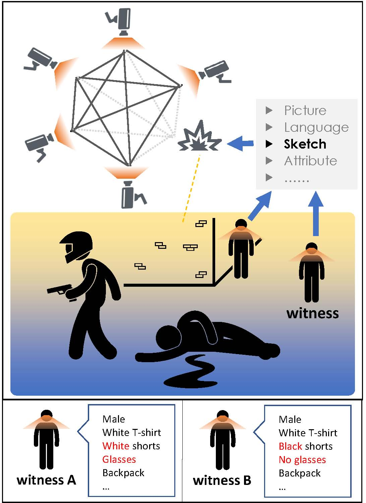
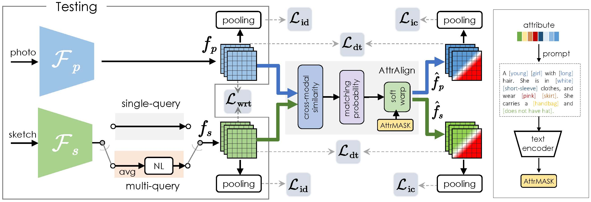

<h2 align="center">Beyond Domain Gap: Exploiting Subjectivity in Sketch-Based Person Retrieval
</h2>
<p align="center">Kejun Lin, Zhixiang Wang, Zheng Wang, Yinqiang Zheng, Shin'ichi Satoh
</p>
<p align="center">Accepted to ACMMM2023
</p>

<<<<<<< HEAD
This is the official respository of paper "Beyond Domain Gap: Exploiting Subjectivity in Sketch-Based
Person Retrieval".

## Dataset

The dataset is available at: https://drive.google.com/drive/folders/1XjFPM1yVHpE38sSDTFgM5s9aX2r-oYRC?usp=sharing

## requirements
=======
<div align="center">

[](https://arxiv.org/pdf/2309.08372v1)
[![CC BY-NC-SA 4.0][cc-by-nc-sa-shield]][cc-by-nc-sa]

</div>

<div align="center">
</image>
</div>

## Dataset

Our proposed MaSk1K (Short for <u>Ma</u>rket-<u>Sk</u>etch-<u>1K</u>) dataset is available <a href="https://drive.google.com/drive/folders/1XjFPM1yVHpE38sSDTFgM5s9aX2r-oYRC?usp=sharing">here</a>.

Download the dataset and Market1501 attributes from <a href="https://github.com/vana77/Market-1501_Attribute.git">here</a>, and put it into your \<data_path\>.

This work is licensed under a
[Creative Commons Attribution-NonCommercial-ShareAlike 4.0 International License][cc-by-nc-sa].

[cc-by-nc-sa]: http://creativecommons.org/licenses/by-nc-sa/4.0/
[cc-by-nc-sa-shield]: https://img.shields.io/badge/License-CC%20BY--NC--SA%204.0-lightgrey.svg

## Guide For Market-Sketch-1K

<div align="center">
</image>
</div>

### requirements
download the necessary dependencies using cmd.
```bash
pip install -r requirements.txt
```

### preprocess
```python
python preprocess.py --data_path=<data_path> --train_style <train_style> [--train_mq]
```

 - `<data_path>` should be replaced with the path to your data.
 - `<train_style>` refers to the styles you want to include in your training set. You can use any combination of styles A-F, such as B, AC, CEF, and so on.
-  `[--train_mq]` argument is optional and can be used to enable multi-query during training.

### start training
```
python train.py --train_style <train_style> --test_style <test_style> [--train_mq] [--test_mq]
```

 - `<train_style>` and `<test_style>` should be replaced with the styles you want to use for your training and testing sets, respectively. Just like in the preprocessing step, you can use any combination of styles A-F.
 - `[--train_mq]` argument is used for enabling multi-query during training, and `[--test_mq]` serves a similar purpose during testing.
>>>>>>> 8c9a7e50373faa3000248d9054836246860955d7

### Evaluation
```python
python test.py --train_style <train_style> --test_style <test_style> --resume <model_filename> [--test-mq]
```
 - `<train_style>` should be replaced with the styles you used for your training.
 - `<test_style>` should be replaced with the styles you want to use for your testing.
 - `<model_filename>` should be the filename of your trained model.
 - `[--test_mq]` argument is used for enabling multi-query during testing.

## Acknowledgements
Our code was build on the amazing codebase <a href="https://github.com/mangye16/Cross-Modal-Re-ID-baseline.git">Cross-modal-Re-ID</a> and <a href="https://github.com/cvlab-yonsei/LbA.git">CMAlign</a> and <a href="https://github.com/openai/CLIP.git">CLIP</a>. 

## Citation
If you find our work helpful, please consider citing our work using the following bibtex.
```
@inproceedings{lin2023subjectivity,
  title={Beyond Domain Gap: Exploiting Subjectivity in Sketch-Based Person Retrieval},
  author={Lin, Kejun  and  Wang, Zhixiang  and  Wang, Zheng  and  Zheng, Yinqiang and  Satoh, Shin'ichi},
  booktitle={ACM Multimedia},
  year={2023},
}
```